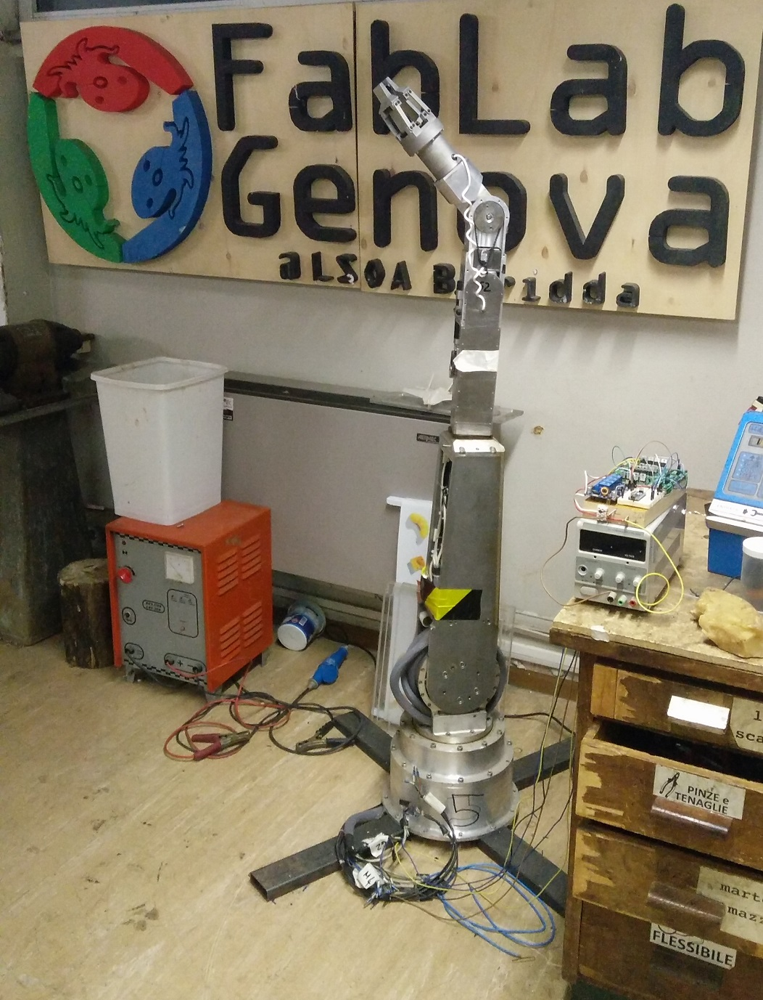

# Robot arm project / Progetto braccio robotico

**[ITA]**

Un po' di tempo fa abbiamo ereditato un braccio robotico dell'Ansaldo che risale ai tardi anni '80 (grazie Bruno).
Abbiamo quindi deciso di rimetterlo in funzione.

L'obiettivo di questo progetto è di riuscire a controllare il braccio "col pensiero" tramite un interfaccia neurale.
Per riuscirci occorre prima risolvere la serie di problemi intermedi elencati qui sotto:
1. ricostruzione delle caratteristiche del robot (modelli motori, specifiche encoder, caratteristiche freni, etc.)
1. controllo con loop di velocità dei giunti tramite
1. coordinamento dei singoli giuni con il nodo centrale per il controllo di alto livello dei movimenti
1. collegamento dell'interfaccia neurale e traduzione dei segnali in input di controllo.

**[ENG]**

A while ago we recovered a robot arm by Ansaldo that dates back to the late 80ies (thank you Bruno).
We decided it is now time to put it back to work.

The aim of this project it to control the arm with a neural interface.
For doing this we must first accomplish the series of sub-tasks listed hereafter:
1. [Joint control](docs/encoders.md): identification and reconstruction of the robot's characteristics (motor models, encoders specs, brakes characteristics, etc.)
1. closed loop control of the joints
1. connection of the single joints to the central computation unit in charge of the planning.
1. connection of the neural interface and translation of the neural signals to control inputs for the robot.
